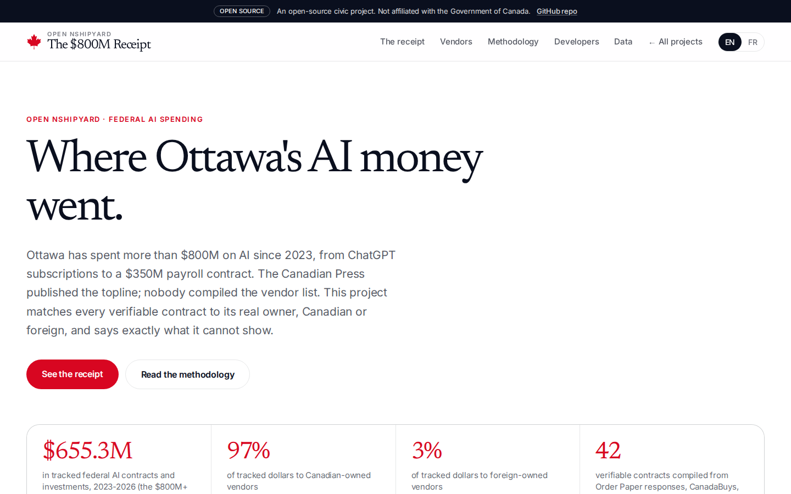
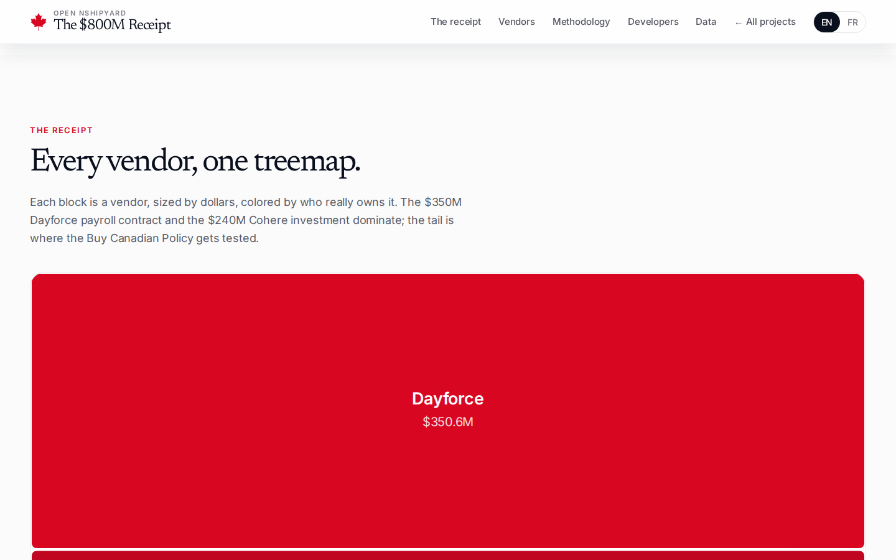


# canada-ai-spending-receipt

The $800M Receipt: of the $800M+ Ottawa has spent on AI since 2023, what share went to Canadian-owned vendors vs foreign ones, contract by contract. An Open Nshipyard project.

The Canadian Press published the topline in May 2026 (from MP Jagsharan Singh Mahal's written question to all departments, agencies, and Crown corporations); nobody compiled the vendor list. This project matches every verifiable contract to its real owner, Canadian or foreign, with the ownership coding published and every row citing its source. It also says exactly what it cannot show: CSE and CSIS declined the request, the RCMP had no centralized data, and the $240M Cohere item is an investment, not a procurement contract.

An open-source civic project. Not affiliated with the Government of Canada.

Live: https://aispend.canada.nshipyard.com (pending deploy)

## Screenshots







## What the data shows

**$655.3M tracked** across 42 verifiable contracts and 39 canonical vendors, against the $800M+ Canadian Press topline (May 2026). Of the tracked dollars:

- **Canadian-owned: $638.5M (97.4%)** - dominated by the $350.6M Dayforce payroll contract (PSPC, 10 years, signed June 2025) and the $240M Cohere investment (ISED, AI Compute Challenge, Dec 2024).
- **Foreign-owned: $16.4M (2.5%)** - the largest foreign vendor is Thales (France, $10.3M across two contracts); the Procura tail adds Teksystems and Infosys Public Services (both US, listed as Ottawa-based in Q-1229).
- **Ownership uncertain: $0.4M (0.1%)** - including PwC and two numbered companies, listed separately and excluded from both shares.

Procurement-only total: $415.3M. The $240M Cohere item is an investment, reported separately so the December 2025 Buy Canadian Policy can be tested against actual awards.

The split is honest about its limits: this is the verifiable portion of the topline, a floor, not a census. Two flags ride with the Canadian share: Thoma Bravo (US) closed a US$12.3B acquisition of Dayforce in February 2026, after the contract award; and Cohere used the federal money to commission American-owned CoreWeave to build and operate the Canadian data centre.

## Files

- `data/contracts.json` - contract-by-contract list: department, vendor, amount, fiscal year, procurement vs investment, source URL
- `data/vendors.json` - canonical vendors: ownership coding (canadian/foreign/uncertain), HQ country, evidence link, merged name variants, spend, contracts
- `data/summary.json` - headline aggregates with the counting rule and caveats
- `public/data/contracts.csv`, `public/data/vendors.csv`, `public/data/summary.json` - downloadable copies
- `scripts/build_data.py` - the reproducible pipeline from the researched CSVs

## Methodology

Sources: the Canadian Press topline (May 13, 2026); parliamentary Order Paper written-question responses; CanadaBuys contract award notices; the Wire Report's Q-1229 investigation (Oct 1, 2026). Every contract row cites its source URL.

Vendor entity resolution: uppercase, strip punctuation, drop legal suffixes (Ltd, Inc, Corp and others), exact-match on the normalized key. Free-text variants from Order Paper tables merge into one canonical vendor.

Ownership coding: each canonical vendor is coded Canadian-owned, foreign-owned, or uncertain by ultimate headquarters, with a public evidence link per vendor. Registered billing addresses on contracts are not ownership; the Procura case (three US firms listed as Ottawa-based) is why the distinction matters.

Counting rule: the $240M Cohere item is a strategic investment in a Canadian company, not a procurement contract. Totals are reported both ways: combined for the full picture, and procurement-only when testing the December 2025 Buy Canadian Policy against actual awards.

Amounts are award or announced values as published, not audited final payments. This is the verifiable portion of the $800M+ topline, a floor, not a census. Uncertain-ownership vendors are listed separately and excluded from both shares.

Build script: `scripts/build_data.py` reads `~/workspace/build-specs-20261009/ai-receipt-data/{contracts,vendors}.csv`.

## Develop

```bash
npm install
npm run dev
```

## API

REST under `/api/v1/`:

- `GET /api/v1/summary` - headline aggregates: tracked spend, Canadian vs foreign vs uncertain split, by department and fiscal year
- `GET /api/v1/vendor/search?q=cohere&limit=50` - search canonical vendors by name, ranked by total spend
- `GET /api/v1/vendor/lookup?vendor_id=V00001` - full vendor record: ownership coding, HQ country, evidence link, contracts
- `GET /api/v1/contracts?ownership=foreign&limit=10` - contract-by-contract list with ownership flags

OpenAPI 3.1 spec at `/api/openapi.json`.

MCP (streamable HTTP, JSON-RPC 2.0): `POST /mcp` with tools `vendor_lookup`, `vendor_search`, `contracts_list`, `spend_summary`.

## Author

**Richardson Dackam** - [X (@richardsondx)](https://x.com/richardsondx) · [GitHub](https://github.com/richardsondx)

## License

MIT. Contract records are © their publishers (open data / press); the vendor entity resolution and ownership coding are original work.
